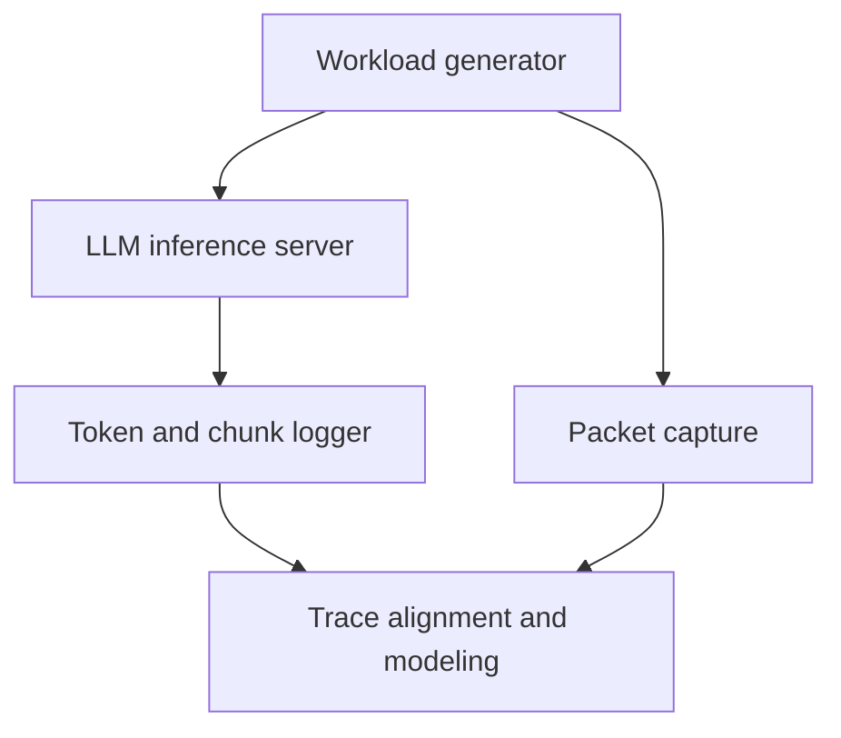

# Token-Conditioned Packet-Level Traffic Modeling for Streaming LLM Services

## 基於 Token 特徵之串流大型語言模型封包流量建模

---

## 1. Project Overview

Large Language Model (LLM) services usually deliver generated text through streaming APIs. Unlike conventional web traffic, an LLM response is generated token by token and transmitted as a sequence of small network packets or multi-token chunks.

However, a generated token does not necessarily correspond to exactly one network packet. Multiple tokens may be merged into one application-layer chunk, while one chunk may also be segmented into multiple TCP packets. Packet timing is further affected by model computation, server buffering, transport protocols, network delay, and concurrent requests.

This project measures the relationship among generated tokens, application-layer chunks, and network packets. Based on the collected traces, it develops and validates a token-conditioned packet-level traffic model for streaming LLM services.

The resulting model is intended for network simulation, capacity planning, wireless-network evaluation, and future token communication research.

---

## 2. Problem

Existing LLM serving studies mainly model:

- Request arrival rate
- Input and output token counts
- Time to First Token (TTFT)
- Time per Output Token (TPOT)
- GPU throughput
- Request completion latency

Existing network-side studies have also shown that encrypted LLM traffic contains observable packet-size and timing patterns. However, most of these studies use packet size and timing as features for traffic classification, model fingerprinting, or privacy attacks.

They do not provide a complete traffic model that explains how token generation is converted into application chunks and network packets.

The research problem is therefore:

> How can we characterize and model the packet size and packet interarrival time of streaming LLM traffic as functions of token generation, server load, packetization behavior, transport configuration, and network conditions?

The target model is:

$$
P(S_i, I_i, D_i, N_i
\mid
L_{\mathrm{in}},
L_{\mathrm{out}},
C,
M,
H,
R,
T,
\Phi)
$$

where:

| Symbol | Definition |
|---|---|
| $S_i$ | Size of packet $i$ |
| $I_i$ | Interarrival time of packet $i$ |
| $D_i$ | Direction of packet $i$: uplink or downlink |
| $N_i$ | Number of generated tokens associated with packet $i$ |
| $L_{\mathrm{in}}$ | Number of input tokens |
| $L_{\mathrm{out}}$ | Number of output tokens |
| $C$ | Number of concurrent requests |
| $M$ | LLM and model size |
| $H$ | Server hardware and inference configuration |
| $R$ | Request arrival process |
| $T$ | Transport and streaming configuration |
| $\Phi$ | Request phase |

---

## 3. Importance

A realistic LLM traffic model is important for the following reasons.

### 3.1 Network simulation

Traditional traffic models such as constant-bit-rate, Poisson packet arrivals, file transfer, and video streaming may not represent the token-by-token behavior of LLM services.

A packet-level model can be implemented in ns-3 or another network simulator to evaluate LLM services over:

- Wi-Fi networks
- 5G and beyond-5G networks
- Edge computing systems
- Satellite and non-terrestrial networks
- Congested or lossy access networks

### 3.2 Resource allocation

Average bandwidth alone cannot describe an LLM workload. Although text traffic generally requires limited average bandwidth, token streaming may produce frequent small packets and bursty transmission patterns.

These characteristics may affect:

- Queueing delay
- Wireless channel access
- Packet scheduling
- Protocol overhead
- Energy consumption
- Transport efficiency

### 3.3 Token communication

Future token communication systems may treat tokens as communication units rather than transmitting only conventional byte streams.

Before designing token-aware transmission mechanisms, it is necessary to understand:

- How many tokens are placed in one chunk
- How chunks are mapped to packets
- How token-generation timing appears as packet-arrival timing
- Which portions of packet timing are caused by computation and which are caused by the network

### 3.4 Reproducible LLM workload evaluation

A validated traffic generator would allow researchers to evaluate LLM network performance without repeatedly accessing a commercial LLM API or reproducing the complete inference system.

---

## 4. Challenges

### 4.1 A token is not equal to a packet

The following one-to-one relationship generally does not hold:

$$
1\ \text{token} = 1\ \text{packet}
$$

The actual relationship is:


Multiple tokens may be merged into one chunk because of server buffering or speculative decoding. A large chunk may also be segmented into multiple packets.

Therefore, packet size cannot be modeled only from individual token length.

### 4.2 Packet IAT contains multiple delays

Let $g_j$ denote the generation time of token $j$, and let $a_i$ denote the arrival time of packet $i$.

The token-generation interval is:

$$
I_j^{\mathrm{token}} = g_j-g_{j-1}
$$

The packet interarrival time is:

$$
I_i^{\mathrm{packet}} = a_i-a_{i-1}
$$

The observed packet IAT is affected by multiple components:

$$
I_i^{\mathrm{packet}}
=
I_i^{\mathrm{generation}}
+
D_i^{\mathrm{buffer}}
+
D_i^{\mathrm{packetization}}
+
D_i^{\mathrm{network}}
$$

It is therefore difficult to determine whether a long IAT is caused by:

- Slow token generation
- GPU contention
- Continuous batching
- Server-side buffering
- TCP or TLS processing
- Network delay or jitter
- Packet loss and retransmission

### 4.3 Encryption hides token boundaries

When HTTPS is used, packet capture tools can observe packet sizes, directions, and timestamps, but cannot directly identify token or application-chunk boundaries.

Ground-truth logs must therefore be collected from the LLM server and client and aligned with the packet trace.

### 4.4 LLM behavior depends on system configuration

Packet patterns may change with:

- Model size
- Input length
- Output length
- GPU type
- Quantization
- Speculative decoding
- Continuous batching
- Number of concurrent requests
- Streaming protocol
- Connection reuse

A useful model must specify these conditions rather than assuming that all LLM services generate the same traffic.

### 4.5 Network measurement may contain artifacts

NIC functions such as TCP Segmentation Offload, Generic Segmentation Offload, and Generic Receive Offload may cause captured packet sizes to differ from packets transmitted over the physical link.

TCP ACKs, retransmissions, connection establishment, and background traffic may also distort the packet-size and IAT distributions.

---

## 5. System

### 5.1 System architecture

The system consists of five components:



1. **Workload Generator**

   Sends controlled prompts to the LLM server and records request information.

2. **LLM Inference Server**

   Runs an open-source LLM through an OpenAI-compatible streaming API.

3. **Token and Chunk Logger**

   Records token generation and application-layer transmission events.

4. **Packet Capture Module**

   Captures packet timestamps, sizes, directions, TCP streams, and retransmissions.

5. **Traffic Modeling Module**

   Aligns token, chunk, and packet traces and constructs a statistical traffic model.

### 5.2 Suggested implementation

| Component | Suggested tool |
|---|---|
| LLM server | vLLM or Ollama |
| Open-source model | Llama, Mistral, Gemma, or Qwen |
| Workload generator | Python asynchronous client |
| Tokenizer | Hugging Face tokenizer |
| Packet capture | tcpdump or Wireshark |
| Packet extraction | tshark |
| Network control | Linux `tc netem` |
| System monitoring | Prometheus and NVIDIA DCGM Exporter |
| Statistical analysis | Python, pandas, SciPy, and statsmodels |
| Traffic replay | Python generator or ns-3 application |

### 5.3 Measurement points

The primary packet trace is collected at the client-side network interface.

The following three timelines are recorded:

| Timeline | Recorded information |
|---|---|
| Server timeline | Token generation or server emission timestamps |
| Client application timeline | Streaming chunk arrival timestamps and chunk sizes |
| Client network timeline | Packet arrival timestamps and packet sizes |

A unique `request_id` is used to associate the three timelines.

---

## 6. Assumptions

### 6.1 Basic system assumptions

1. The LLM is deployed on a controlled server.
2. The model tokenizer is available.
3. The client and server clocks are synchronized.
4. Each request has a unique request identifier.
5. The model, GPU, decoding parameters, and serving configuration are recorded.
6. The primary experiment uses text-only prompts and responses.
7. Background traffic unrelated to the experiment is filtered out.
8. The client and server are initially connected through a stable wired LAN.
9. Packet loss and network delay are introduced only in designated experiments.
10. The same prompt set is used across repeated experiments.

### 6.2 Packet definitions

The primary packet size is defined as the IP packet length:

$$
S_i^{\mathrm{IP}} = \texttt{ip.len}
$$

The TCP payload length is additionally recorded:

$$
S_i^{\mathrm{payload}} = \texttt{tcp.len}
$$

Packet IAT is calculated within the same flow and direction:

$$
I_i^{(f,d)}
=
a_i^{(f,d)}-a_{i-1}^{(f,d)}
$$

where:

- $f$ denotes a TCP or QUIC flow.
- $d$ denotes uplink or downlink direction.

The primary model considers data-bearing packets:

$$
\texttt{tcp.len} > 0
$$

ACK-only and control packets are analyzed separately.

### 6.3 Ground-truth and encrypted experiments

Two operating modes are considered:

1. **Ground-truth mode**

   Plain HTTP or decryptable TLS is used in an isolated testbed to identify exact chunk boundaries and token-to-chunk mappings.

2. **Realistic mode**

   HTTPS is used to reproduce encrypted LLM traffic observed by an ordinary network monitor.

The ground-truth mode is used for model construction. The realistic mode is used to determine whether the model remains valid under encryption and protocol overhead.

### 6.4 Output-length control

If the inference server supports ignoring the end-of-sequence token, a fixed number of output tokens is generated.

Otherwise, actual output length is recorded and classified into output-length ranges. The requested `max_tokens` value must not be treated as the actual output length.

### 6.5 Capture assumptions

NIC offloading is disabled when physical packet size is the target measurement. At minimum, the following configurations are documented:

- MTU
- TSO
- GSO
- GRO
- TLS enabled or disabled
- Persistent or new TCP connection
- HTTP version
- Streaming enabled or disabled

---

## 7. Method

### 7.1 Step 1: Generate controlled workloads

Prompts are generated according to predefined input-length and task categories.

Each request records:

```text
experiment_id
request_id
session_id
model
prompt_type
prompt_tokens
requested_output_tokens
actual_output_tokens
temperature
random_seed
streaming
connection_mode
concurrency
request_start_time
first_token_time
completion_time
```

### 7.2 Step 2: Record token events

For each generated token $j$, record:

```text
request_id
token_id
token_text
token_bytes
generation_timestamp
```

If the inference framework cannot expose the internal generation timestamp, the server-side streaming emission timestamp is used and clearly identified as an approximation.

### 7.3 Step 3: Record application chunks

For each received streaming chunk $k$, record:

```text
request_id
chunk_id
chunk_timestamp
chunk_bytes
number_of_tokens
cumulative_tokens
```

Let $C_k$ denote the chunk size and $N_k$ denote the number of tokens contained in chunk $k$.

The token aggregation relationship is modeled as:

$$
P(N_k \mid C_k, M, C, H)
$$

### 7.4 Step 4: Capture network packets

For each packet $i$, record:

```text
experiment_id
timestamp
source_ip
destination_ip
direction
frame_length
ip_length
tcp_payload_length
tcp_stream
tcp_flags
retransmission
```

The main packet sequence is:

$$
\mathcal{P}
=
\left\{
(D_i,S_i,I_i)
\right\}_{i=1}^{n}
$$

### 7.5 Step 5: Align tokens, chunks, and packets

The three traces are aligned using:

- Request identifier
- TCP connection
- Sequence number
- Timestamp
- Application-chunk size
- Direction

The resulting hierarchy is:

$$
\text{Request}
\rightarrow
\text{Tokens}
\rightarrow
\text{Chunks}
\rightarrow
\text{Packets}
$$

For each request, estimate:

- Tokens per chunk
- Chunks per packet
- Packets per chunk
- Tokens per packet
- Token-to-packet delay
- Chunk-to-packet delay

### 7.6 Step 6: Segment each request into phases

Each request is divided into:

1. Connection establishment
2. Prompt upload
3. TTFT idle period
4. Token streaming
5. Response completion
6. Connection keep-alive or teardown

Let $\Phi_i$ denote the phase of packet $i$.

The phase-conditioned model is:

$$
P(S_i,I_i,D_i\mid\Phi_i)
$$

This avoids incorrectly fitting one distribution to the complete request.

### 7.7 Step 7: Construct the traffic model

The first version uses empirical distributions:

- Packet-size histogram
- Packet-IAT empirical CDF
- Tokens-per-chunk distribution
- Packets-per-chunk distribution
- Conditional two-dimensional histogram of packet size and IAT

The second version constructs a first-order Markov or semi-Markov model.

Define the packet state as:

$$
X_i=(D_i,Q(S_i),\Phi_i)
$$

where $Q(S_i)$ is the discretized packet-size class.

The transition probability is:

$$
P(X_{i+1}\mid X_i)
$$

The holding-time distribution of each state is:

$$
P(I_{i+1}\mid X_i,X_{i+1})
$$

This model jointly represents packet direction, packet size, request phase, and packet timing.

### 7.8 Step 8: Generate synthetic traffic

The fitted model generates a synthetic sequence:

$$
\hat{\mathcal{P}}
=
\left\{
(\hat{D}_i,\hat{S}_i,\hat{I}_i)
\right\}_{i=1}^{\hat{n}}
$$

The synthetic trace is converted into:

- A CSV trace
- A traffic replay script
- An optional PCAP file
- An optional ns-3 traffic generator

### 7.9 Step 9: Validate the model

The collected traces are separated into training and testing sets.

Model parameters are fitted only using the training set. Synthetic traffic is compared with previously unseen testing traces.

A valid traffic model should reproduce:

- Packet-size distribution
- Packet-IAT distribution
- Direction sequence
- Burst duration
- Peak traffic rate
- Request duration
- Total bytes
- Temporal correlation

---

## 8. Metrics

### 8.1 Basic traffic metrics

| Metric | Definition |
|---|---|
| Packet size | IP packet length in bytes |
| TCP payload size | TCP data length in bytes |
| Packet IAT | Time between consecutive packets in the same flow and direction |
| Packet count | Number of packets per request |
| Total traffic | Total uplink and downlink bytes per request |
| Peak rate | Maximum traffic rate in a fixed time window |
| ACK ratio | Proportion of ACK-only packets |
| Retransmission ratio | Proportion of retransmitted packets |

### 8.2 LLM timing metrics

The Time to First Token is:

$$
TTFT=t_{\mathrm{first\ token}}-t_{\mathrm{request}}
$$

The average Time per Output Token is:

$$
TPOT=
\frac{
t_{\mathrm{last\ token}}-t_{\mathrm{first\ token}}
}{
L_{\mathrm{out}}-1
}
$$

The inter-token time is:

$$
ITT_j=g_j-g_{j-1}
$$

### 8.3 Token-to-packet mapping metrics

| Metric | Purpose |
|---|---|
| Tokens per chunk | Measures server-side token aggregation |
| Packets per chunk | Measures transport segmentation |
| Tokens per packet | Measures token-to-packet mapping |
| Token-byte overhead | Compares token text bytes with transmitted bytes |
| Token-to-packet delay | Measures delay from token emission to packet arrival |
| ITT–IAT correlation | Measures whether token-generation rhythm remains visible in packet timing |

The ITT–IAT correlation is evaluated using Pearson and Spearman correlation coefficients.

### 8.4 Burstiness metrics

The coefficient of variation is:

$$
CV_{\mathrm{IAT}}
=
\frac{\sigma_{\mathrm{IAT}}}
{\mu_{\mathrm{IAT}}}
$$

The burstiness index is:

$$
B=
\frac{
\sigma_{\mathrm{IAT}}-\mu_{\mathrm{IAT}}
}{
\sigma_{\mathrm{IAT}}+\mu_{\mathrm{IAT}}
}
$$

The following are also calculated:

- Packet-count Fano factor
- IAT autocorrelation
- Peak-to-mean traffic ratio
- Burst duration
- Number of packets per burst

### 8.5 Model accuracy metrics

| Metric | Comparison target |
|---|---|
| Kolmogorov–Smirnov distance | Packet-size and IAT distributions |
| Jensen–Shannon divergence | Discrete empirical distributions |
| Wasserstein distance | Continuous packet-size and IAT distributions |
| Autocorrelation error | Temporal dependency |
| Transition-matrix error | Packet-state sequence |
| Percentile error | P50, P90, P95, and P99 |
| Mean absolute percentage error | Packet count, bytes, duration, and peak rate |

For a metric $Y$, percentile error is defined as:

$$
E_{P_q}
=
\frac{
\left|
P_q(Y_{\mathrm{synthetic}})
-
P_q(Y_{\mathrm{real}})
\right|
}{
P_q(Y_{\mathrm{real}})
}
$$

---

## 9. Experiment Design

## 9.1 Experiment 0: Measurement Calibration

### Objective

Verify that the packet-capture and timestamp-alignment mechanisms are correct.

### Configuration

- One client
- One LLM server
- Stable wired LAN
- Concurrency = 1
- Plain HTTP
- Streaming enabled
- Fixed prompt
- Fixed output-token count
- NIC offloading disabled

### Measurements

- Token timestamps
- Chunk timestamps
- Packet timestamps
- Chunk bytes
- TCP payload bytes
- Missing or unmatched events

### Expected output

A complete mapping among tokens, chunks, and packets for each request.

---

## 9.2 Experiment 1: Effect of Input and Output Lengths

### Objective

Determine how input and output token counts affect packet size, packet count, traffic volume, and packet IAT.

### Independent variables

| Variable | Values |
|---|---|
| Input tokens | 128, 1,024, 4,096 |
| Output tokens | 64, 256, 1,024 |
| Streaming | Enabled |
| Concurrency | 1 |

Each configuration is repeated for at least 100 requests.

The minimum number of requests is:

$$
3\times3\times100=2{,}700
$$

### Controlled variables

- Same model
- Same GPU
- Same decoding parameters
- Same transport protocol
- Same network path
- Same connection mode

### Dependent variables

- Packet-size distribution
- Packet-IAT distribution
- Number of packets
- Total transmitted bytes
- Tokens per chunk
- Packets per chunk
- TTFT
- TPOT

### Research questions

1. Does prompt length primarily affect uplink packet count?
2. Does output length change downlink packet count without changing the packet-size distribution?
3. Does a longer output change packet IAT because of increasing decode time or KV-cache growth?

---

## 9.3 Experiment 2: Effect of Streaming and Transport Configuration

### Objective

Determine how application and transport configurations change token packetization.

### Independent variables

| Variable | Values |
|---|---|
| Response mode | Streaming, non-streaming |
| Encryption | HTTP, HTTPS |
| Connection | Persistent, new connection |
| Transport | TCP-based HTTP; QUIC if supported |

### Controlled variables

- Input tokens
- Output tokens
- Model
- GPU
- Concurrency
- Network condition

### Dependent variables

- Packet-size distribution
- Packet-IAT distribution
- Control-packet overhead
- Tokens per packet
- Packets per response
- Response completion time

### Research questions

1. How does streaming change the proportion of small packets?
2. How much traffic overhead is introduced by TLS and connection establishment?
3. Does connection reuse significantly change the observed packet model?
4. Does QUIC produce a different packet-size and IAT pattern from TCP?

---

## 9.4 Experiment 3: Effect of Concurrent Requests and Server Load

### Objective

Determine how server-side queueing and continuous batching affect packet timing and burstiness.

### Independent variables

| Variable | Values |
|---|---|
| Concurrency | 1, 8, 32 |
| Request arrivals | Fixed interval, Poisson, bursty |
| Speculative decoding | Disabled, enabled if supported |

### Controlled variables

- Model
- GPU
- Prompt set
- Output-token range
- Network path
- Streaming protocol

### Additional system metrics

- GPU utilization
- GPU memory utilization
- KV-cache utilization
- Batch size
- Queue length
- Number of active requests

### Research questions

1. Does higher concurrency increase packet IAT because of GPU scheduling?
2. Does continuous batching cause token packets to arrive in periodic bursts?
3. Does speculative decoding increase the number of tokens per chunk or packet?
4. Can packet IAT still represent token-generation time under high load?

---

## 9.5 Experiment 4: Effect of Network Conditions

### Objective

Separate inference-generated timing from network-generated timing.

### Independent variables

| Network condition | Values |
|---|---|
| Added one-way delay | 0, 20, 80 ms |
| Jitter | 0, 10 ms |
| Packet loss | 0%, 1% |
| Bandwidth limit | Unlimited, constrained |

### Controlled variables

- Same token-generation trace
- Same model
- Same prompt
- Same concurrency
- Same transport configuration

### Dependent variables

- Packet IAT
- Token-to-packet delay
- Retransmission ratio
- Response stall frequency
- P95 and P99 packet IAT
- ITT–IAT correlation

### Research questions

1. Under what conditions does packet IAT stop reflecting token-generation timing?
2. How much packet-IAT variance is introduced by the network?
3. How do loss and retransmission affect token streaming continuity?

---

## 9.6 Experiment 5: Traffic Model Validation

### Objective

Determine whether the proposed model can reproduce previously unseen LLM traffic.

### Procedure

1. Use 70% of requests to construct the traffic model.
2. Reserve 30% of requests for testing.
3. Generate synthetic packet traces using the fitted model.
4. Compare synthetic and real traces.
5. Replay synthetic traffic through a controlled network.
6. Compare network queueing and delay results.

### Validation targets

The model should reproduce:

- Packet-size CDF
- Packet-IAT CDF
- P50, P95, and P99 IAT
- Packet direction sequence
- Average and peak traffic rates
- Packet count per request
- Total bytes per request
- Burst duration
- Request completion time

### Baselines

The proposed model is compared against:

1. Fixed packet size with constant IAT
2. Empirical packet size with independent exponential IAT
3. Independent empirical packet size and IAT distributions
4. Phase-conditioned packet model
5. Proposed token-conditioned joint packet model

The comparison determines whether token information and temporal dependency materially improve traffic-model accuracy.

---

## 10. Minimum Viable Project Scope

The minimum undergraduate project should complete:

1. One open-source LLM
2. One GPU server
3. TCP-based streaming API
4. Input/output length experiment
5. Concurrency experiment
6. Token, chunk, and packet trace alignment
7. Packet-size and packet-IAT characterization
8. Phase-conditioned empirical traffic model
9. Synthetic trace generation
10. Statistical validation against real traces

The following are optional extensions:

- Multiple LLMs
- Speculative decoding
- HTTPS and QUIC comparison
- Network impairment
- ns-3 integration
- Traffic classification
- Privacy analysis
- Token-aware packet scheduling

---

## 11. Expected Contributions

This project is expected to:

1. **Characterize** the packet-size and packet-IAT patterns of streaming LLM services under controlled input length, output length, and concurrency settings.

2. **Quantify** the relationship among token-generation intervals, application-layer chunks, and network packets.

3. **Develop** a phase-conditioned and token-conditioned packet traffic model that preserves packet size, direction, timing, and burst dependency.

4. **Generate** synthetic LLM packet traces that can be replayed or integrated into network simulations.

5. **Validate** whether the proposed model reproduces the statistical and temporal characteristics of real LLM traffic more accurately than independent packet-size and IAT models.

---

## 12. Expected Deliverables

- Reproducible workload-generation scripts
- Token-level ground-truth logs
- Application-chunk logs
- Packet capture files
- Processed packet-level dataset
- Traffic characterization report
- Token-conditioned traffic model
- Synthetic traffic generator
- Model validation results
- Optional ns-3 implementation

---

## 13. Research Scope Boundary

This project focuses on traffic characterization and traffic generation.

The following are not primary objectives:

- Identifying which commercial LLM generated a response
- Recovering encrypted response content
- Performing privacy attacks
- Optimizing the internal LLM architecture
- Designing a complete semantic communication system

Security and token communication studies are used as supporting evidence because they demonstrate that packet size and packet timing contain information about token generation and server-side inference behavior.

---

## 14. Reference Papers

1. S. Alhazbi, A. Hussain, G. Oligeri, and P. Papadimitratos,  
   “LLMs Have Rhythm: Fingerprinting Large Language Models Using Inter-Token Times and Network Traffic Analysis,”  
   *IEEE Open Journal of the Communications Society*, 2025.  
   <https://doi.org/10.1109/OJCOMS.2025.3577016>

2. A. Montieri, A. Nascita, and A. Pescapè,  
   “From Prompts to Packets: A View from the Network on ChatGPT, Copilot, and Gemini,”  
   *Computer Networks*, 2026.  
   <https://doi.org/10.1016/j.comnet.2026.112237>

3. H. Li, Y. Liu, Y. Cheng, S. Ray, K. Du, and J. Jiang,  
   “Eloquent: A More Robust Transmission Scheme for LLM Token Streaming,” 2024.  
   <https://arxiv.org/abs/2401.12961>

4. S. Li et al.,  
   “From Length to Content: Token-Length Side-Channel Attacks on LLM API Merged Outputs,”  
   *35th USENIX Security Symposium*, 2026.  
   <https://www.usenix.org/conference/usenixsecurity26/presentation/li-sijia>

5. M. Soleimani, G. Jia, I. Gim, S. Lee, and A. Khandelwal,  
   “Wiretapping LLMs: Network Side-Channel Attacks on Interactive LLM Services,”  
   *Cryptology ePrint Archive*, Paper 2025/167, 2025.  
   <https://eprint.iacr.org/2025/167>

6. N. Carlini and M. Nasr,  
   “Remote Timing Attacks on Efficient Language Model Inference,” 2024.  
   <https://arxiv.org/abs/2410.17175>

7. R. Weiss, D. Ayzenshteyn, and Y. Mirsky,  
   “What Was Your Prompt? A Remote Keylogging Attack on AI Assistants,”  
   *33rd USENIX Security Symposium*, 2024.  
   <https://www.usenix.org/conference/usenixsecurity24/presentation/weiss>

8. Y. Wang et al.,  
   “BurstGPT: A Real-World Workload Dataset to Optimize LLM Serving Systems,”  
   *ACM SIGKDD*, 2025.  
   <https://arxiv.org/abs/2401.17644>
