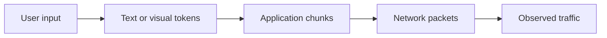
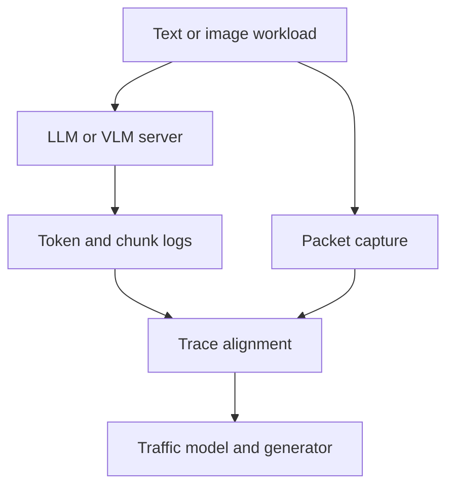

# Token-Conditioned Packet-Level Traffic Modeling for LLM and VLM Services

## 基於文字與視覺 Token 特徵之 LLM/VLM 封包流量建模

---

## 1. Project Overview

Large Language Model (LLM) and Vision-Language Model (VLM) services process text, images, and other multimodal inputs through remote inference APIs.

An LLM request normally contains text input and produces a streamed text response. A VLM request additionally uploads one or more images, which are converted by the server into visual tokens before multimodal inference. These two services therefore produce different network traffic patterns:

- LLM：text upload followed by streamed text-token delivery.
- VLM：image and text upload followed by visual encoding, multimodal prefill, and streamed text-token delivery.

This project measures how text tokens, visual tokens, application-layer chunks, and network packets are related. Based on the collected traces, it develops a token-conditioned packet-level traffic model for LLM and VLM inference services.

The resulting model can support network simulation, resource allocation, wireless QoS evaluation, edge-AI deployment, and future token communication research.

---

## 2. Problem

Existing LLM serving studies mainly characterize request arrival rate, token length, TTFT, TPOT, GPU utilization, and request completion latency.

Existing network-side studies show that encrypted LLM traffic contains observable packet-size and timing patterns. However, most studies use these patterns for traffic classification, model fingerprinting, or privacy attacks. They generally do not construct a reproducible traffic model connecting:



For VLM services, the relationship is more complicated because the uploaded image size is not equal to the number of visual tokens:

$$
\text{Image bytes}
\neq
\text{Visual tokens}
\neq
\text{Network packets}
$$

The main research problem is:

> How can we characterize and model the packet size and packet interarrival time of LLM and VLM services as functions of input modality, text-token length, visual-token length, output-token length, server load, packetization behavior, and network conditions?

The target traffic model is:

$$
P(S_i,I_i,D_i,N_i^{\mathrm{text}},N_i^{\mathrm{vision}}
\mid
Z,B_{\mathrm{image}},L_{\mathrm{text}},L_{\mathrm{vision}},
L_{\mathrm{out}},C,M,T,\Phi)
$$

where:

| Symbol | Definition |
|---|---|
| $S_i$ | Size of packet $i$ |
| $I_i$ | Interarrival time of packet $i$ |
| $D_i$ | Packet direction |
| $N_i^{\mathrm{text}}$ | Number of text tokens associated with packet $i$ |
| $N_i^{\mathrm{vision}}$ | Number of visual tokens associated with the request |
| $Z$ | Input modality: text-only or image-text |
| $B_{\mathrm{image}}$ | Compressed image size in bytes |
| $L_{\mathrm{text}}$ | Number of input text tokens |
| $L_{\mathrm{vision}}$ | Number of visual tokens produced by the VLM |
| $L_{\mathrm{out}}$ | Number of output text tokens |
| $C$ | Number of concurrent requests |
| $M$ | LLM or VLM model |
| $T$ | Transport and streaming configuration |
| $\Phi$ | Request phase |

---

## 3. Importance

### 3.1 Realistic AI traffic modeling

Traditional web, file-transfer, and video traffic models cannot completely represent LLM/VLM inference traffic.

LLM traffic usually contains:

- A relatively small text upload
- A TTFT idle interval
- A sequence of small streamed response packets

VLM traffic additionally contains:

- A potentially large image-upload burst
- Image preprocessing and visual-encoding delay
- Multimodal prefill delay
- A streamed text response

A modality-aware traffic model is necessary to reproduce these differences.

### 3.2 Wireless and edge-network evaluation

Although text generation may consume limited average bandwidth, frequent small packets may introduce considerable protocol and channel-access overhead.

VLM requests additionally introduce large uplink image transfers. These characteristics may affect:

- Wireless channel utilization
- Queueing delay
- Uplink/downlink asymmetry
- Packet scheduling
- Edge-server placement
- Energy consumption
- QoS differentiation

### 3.3 Token communication

Token communication requires understanding the relationship between semantic processing units and transmitted packets.

For LLMs, the important units are text tokens. For VLMs, they include:

- Input text tokens
- Input visual tokens
- Output text tokens

A network normally observes image bytes and encrypted packets rather than the internal visual tokens. This project provides the missing mapping between these layers.

### 3.4 Reproducible workload generation

A validated traffic model can generate synthetic LLM/VLM packet traces without repeatedly running expensive models or accessing commercial APIs.

---

## 4. Challenges

### 4.1 Different tokenization mechanisms

Text tokens are generated by a text tokenizer. Visual tokens are generated through image preprocessing, patch extraction, vision encoding, and optional token compression.

The number of visual tokens may depend on:

- Image resolution
- Aspect ratio
- Patch size
- Cropping or resizing policy
- Number of images
- VLM architecture
- Dynamic-resolution mechanism

Therefore:

$$
L_{\mathrm{vision}}
=
f_M(W,H,A,N_{\mathrm{image}},P)
$$

where $W$ and $H$ are image dimensions, $A$ is aspect ratio, and $P$ represents model-specific preprocessing.

### 4.2 Image size does not determine visual-token count

Two images with identical resolution may have different JPEG or WebP file sizes but produce the same number of visual tokens.

Conversely, two images with similar file sizes may be resized differently and produce different visual-token counts.

The model must therefore record both:

- Encoded image size in bytes
- Internal visual-token count

### 4.3 Tokens do not map one-to-one to packets

Multiple text tokens may be merged into one streaming chunk. One image or chunk may also be segmented into multiple TCP packets.

The complete mapping is:

$$
\text{Input data}
\rightarrow
\text{Model tokens}
\rightarrow
\text{Application chunks}
\rightarrow
\text{Transport packets}
$$

### 4.4 Packet IAT combines computation and communication

For LLMs:

$$
I_i^{\mathrm{packet}}
=
I_i^{\mathrm{text-generation}}
+
D_i^{\mathrm{buffer}}
+
D_i^{\mathrm{network}}
$$

For VLMs, TTFT additionally contains:

$$
TTFT_{\mathrm{VLM}}
=
D_{\mathrm{upload}}
+
D_{\mathrm{preprocess}}
+
D_{\mathrm{vision}}
+
D_{\mathrm{queue}}
+
D_{\mathrm{prefill}}
+
D_{\mathrm{delivery}}
$$

These delay components must be separately recorded when the inference framework permits.

### 4.5 Encryption hides application boundaries

HTTPS packet traces reveal packet size, direction, and timing, but do not directly reveal:

- Image boundary
- Text-token boundary
- Visual-token boundary
- Streaming-chunk boundary

Server-side and client-side ground-truth logs are therefore required.

---

## 5. System

## 5.1 System architecture



The system contains:

1. **Workload generator**

   Sends text-only and image-text requests.

2. **LLM/VLM inference server**

   Provides an OpenAI-compatible streaming API.

3. **Token logger**

   Records text-token and visual-token information.

4. **Application-chunk logger**

   Records request upload and streamed response chunks.

5. **Packet-capture module**

   Records packet sizes, timestamps, directions, flows, and retransmissions.

6. **Traffic-modeling module**

   Aligns events and constructs the conditional traffic model.

7. **Traffic generator**

   Produces synthetic CSV, PCAP, or ns-3 traffic.

## 5.2 Request types

| Request type | Input | Output |
|---|---|---|
| LLM | Text | Streamed text |
| VLM-VQA | Image and question | Short text answer |
| VLM-description | Image and instruction | Image description |
| VLM-OCR | Image containing text | Extracted text |
| VLM-reasoning | Image and reasoning question | Longer text answer |

Image-generation models are excluded from the primary scope because their output consists of large image files rather than text-token streaming.

---

## 6. Assumptions

1. The LLM and VLM are deployed on a controlled server.
2. Their text tokenizers and image preprocessing procedures are available.
3. The VLM exposes or allows estimation of the number of visual tokens.
4. The primary VLM configuration accepts locally uploaded images.
5. Image URL requests are excluded because the server may retrieve the image through a separate network path.
6. LLM and VLM responses are text-only and delivered through streaming.
7. Client and server clocks are synchronized.
8. Each request has a unique `request_id`.
9. Model, GPU, decoding parameters, image preprocessing, and serving configurations are recorded.
10. The primary experiment uses a stable wired LAN.
11. Network impairments are introduced only in designated experiments.
12. Background traffic is filtered out.
13. Data packets and ACK-only packets are modeled separately.
14. NIC offloading settings and MTU are documented.
15. The primary packet size is `ip.len`; `tcp.len` is recorded as the transport payload size.
16. Packet IAT is calculated within the same flow and direction.

The packet IAT is:

$$
I_i^{(f,d)}
=
a_i^{(f,d)}-a_{i-1}^{(f,d)}
$$

where $f$ is the flow and $d$ is the packet direction.

---

## 7. Method

### 7.1 Workload construction

The dataset contains controlled LLM and VLM requests.

Each request records:

```text
experiment_id
request_id
request_type
model
input_modality
prompt_tokens
image_count
image_format
image_width
image_height
image_bytes
visual_tokens
output_tokens
temperature
random_seed
streaming
concurrency
request_start_time
first_token_time
completion_time
```

### 7.2 Token and image preprocessing records

For LLM requests, record:

```text
input_text_tokens
output_text_tokens
token_generation_timestamps
```

For VLM requests, additionally record:

```text
original_image_bytes
encoded_image_bytes
image_resolution
resized_resolution
patch_count
visual_token_count
image_preprocessing_time
vision_encoding_time
```

### 7.3 Application-chunk records

For each upload or response chunk, record:

```text
request_id
chunk_id
chunk_direction
chunk_timestamp
chunk_bytes
text_tokens_in_chunk
```

Input visual tokens are generated after the image reaches the server. They must therefore be associated with the complete request rather than directly assigned to individual uplink packets.

### 7.4 Packet records

For each packet, record:

```text
request_id
timestamp
direction
frame_length
ip_length
tcp_payload_length
tcp_stream
tcp_flags
retransmission
request_phase
```

### 7.5 Request-phase segmentation

LLM requests are divided into:

1. Connection establishment
2. Text prompt upload
3. Queueing and prefill
4. TTFT
5. Text-token streaming
6. Completion

VLM requests are divided into:

1. Connection establishment
2. Text and image upload
3. Image preprocessing
4. Vision encoding
5. Multimodal prefill
6. TTFT
7. Text-token streaming
8. Completion

### 7.6 Model construction

Separate models are first developed for LLM and VLM traffic:

$$
P_{\mathrm{LLM}}(S_i,I_i,D_i\mid
L_{\mathrm{text}},L_{\mathrm{out}},C,\Phi)
$$

$$
P_{\mathrm{VLM}}(S_i,I_i,D_i\mid
B_{\mathrm{image}},L_{\mathrm{vision}},
L_{\mathrm{text}},L_{\mathrm{out}},C,\Phi)
$$

A unified modality-conditioned model is then constructed:

$$
P(S_i,I_i,D_i\mid Z,\mathbf{F},\Phi)
$$

where $\mathbf{F}$ contains the model, workload, token, image, and server-load features.

The basic model uses:

- Empirical packet-size distributions
- Empirical packet-IAT distributions
- Conditional two-dimensional histograms
- Phase-conditioned packet distributions

The advanced model uses a Markov or semi-Markov process:

$$
X_i=(D_i,Q(S_i),\Phi_i,Z)
$$

$$
P(X_{i+1},I_{i+1}\mid X_i,\mathbf{F})
$$

### 7.7 Synthetic traffic generation

The fitted model generates:

$$
\hat{\mathcal{P}}
=
\left\{
(\hat{D}_i,\hat{S}_i,\hat{I}_i)
\right\}_{i=1}^{\hat{n}}
$$

The generator accepts:

```text
model_type
input_modality
text_tokens
image_bytes
visual_tokens
output_tokens
concurrency
network_condition
```

and produces a synthetic packet trace.

---

## 8. Metrics

### 8.1 Network metrics

- Uplink and downlink packet-size distributions
- Uplink and downlink packet-IAT distributions
- Packets per request
- Bytes per request
- Peak traffic rate
- Peak-to-mean traffic ratio
- ACK ratio
- Retransmission ratio
- Burst duration
- Request completion time

### 8.2 LLM/VLM inference metrics

- Time to First Token
- Time per Output Token
- Inter-token time
- Image preprocessing time
- Vision-encoding time
- Prefill time
- Decode time

### 8.3 Cross-layer mapping metrics

| Metric | Definition |
|---|---|
| Text tokens per chunk | Output-token aggregation behavior |
| Packets per chunk | Transport segmentation behavior |
| Text tokens per packet | Relationship between output tokens and packets |
| Image bytes per packet | Uplink image-packetization behavior |
| Image bytes per visual token | Relationship between encoded image and model input |
| Uplink bytes per visual token | Network cost of each visual token |
| Token-to-packet delay | Delay between token emission and packet arrival |
| ITT–IAT correlation | Visibility of model-generation rhythm in network traffic |

VLM uplink cost per visual token is:

$$
C_{\mathrm{vision}}
=
\frac{B_{\mathrm{uplink}}}
{L_{\mathrm{vision}}}
$$

Protocol overhead ratio is:

$$
R_{\mathrm{overhead}}
=
\frac{
B_{\mathrm{network}}-B_{\mathrm{application}}
}{
B_{\mathrm{application}}
}
$$

### 8.4 Model-validation metrics

- Kolmogorov–Smirnov distance
- Jensen–Shannon divergence
- Wasserstein distance
- IAT autocorrelation error
- Packet-state transition error
- P50, P90, P95, and P99 errors
- Packet-count error
- Total-byte error
- Peak-rate error
- Burst-duration error

---

## 9. Experiment Design

## 9.1 Experiment 0: Measurement Calibration

### Objective

Validate token, image, chunk, and packet trace alignment.

### Configuration

- One LLM and one VLM
- One client
- Concurrency = 1
- Stable wired LAN
- Plain HTTP
- Fixed text prompt
- Fixed image
- Fixed output length

### Validation

Confirm that:

- Application bytes match captured payload bytes.
- Text tokens can be mapped to response chunks.
- Image bytes can be mapped to uplink chunks and packets.
- Visual-token counts can be obtained from VLM preprocessing.
- All timestamps use a consistent clock reference.

---

## 9.2 Experiment 1: LLM Text-Only Baseline

### Objective

Establish the text-only LLM traffic model.

| Variable | Values |
|---|---|
| Input text tokens | 128, 1,024, 4,096 |
| Output text tokens | 64, 256, 1,024 |
| Concurrency | 1 |
| Repetitions | At least 100 |

### Outputs

- Uplink packet-size and IAT distributions
- Downlink packet-size and IAT distributions
- Text tokens per chunk
- Text tokens per packet
- TTFT and TPOT

---

## 9.3 Experiment 2: Effect of Image Size and Visual Tokens

### Objective

Determine how image properties and visual-token counts affect VLM uplink traffic and TTFT.

| Variable | Values |
|---|---|
| Image resolution | 224p, 512p, 1,024p |
| Image format | JPEG, PNG |
| Image count | 1, 2, 4 |
| Input text length | Fixed |
| Output length | Fixed or grouped by actual length |
| Concurrency | 1 |

### Outputs

- Image bytes versus visual-token count
- Image bytes versus uplink packet count
- Visual tokens versus TTFT
- Image resolution versus preprocessing time
- Uplink bytes per visual token
- Packet-size and IAT distributions during image upload

### Research questions

1. Does network traffic depend more strongly on compressed image size or visual-token count?
2. Do images with identical resolution but different compression sizes produce similar visual-token counts?
3. Does visual-token count explain TTFT better than image-file size?
4. How much uplink traffic is required per visual token?

---

## 9.4 Experiment 3: Effect of VLM Task Type

### Objective

Determine whether different visual tasks produce different output-token and packet patterns.

| Task | Expected response |
|---|---|
| Visual question answering | Short answer |
| Image description | Medium-length response |
| OCR | Length depends on image text |
| Visual reasoning | Longer reasoning response |

### Controlled variables

- Same image resolution
- Same image format
- Same VLM
- Same GPU
- Same concurrency

### Outputs

- Output-token distribution
- Downlink packet count
- Text tokens per packet
- Packet-IAT distribution
- TTFT and completion time

---

## 9.5 Experiment 4: Effect of Concurrency

### Objective

Measure how server load changes LLM and VLM packet timing.

| Variable | Values |
|---|---|
| Model type | LLM, VLM |
| Concurrency | 1, 8, 32 |
| Arrival process | Fixed, Poisson, bursty |
| Input modality | Text, image-text |

### Additional measurements

- GPU utilization
- GPU memory
- KV-cache utilization
- Queue length
- Batch size
- Active requests

### Research questions

1. Does VLM traffic experience greater TTFT growth under concurrency?
2. Does continuous batching change packet IAT?
3. Does VLM preprocessing produce additional uplink/downlink bursts?
4. Can packet IAT still represent token-generation timing under high load?

---

## 9.6 Experiment 5: Effect of Network Conditions

### Objective

Separate model-generated timing from network-generated timing.

| Variable | Values |
|---|---|
| Added delay | 0, 20, 80 ms |
| Jitter | 0, 10 ms |
| Packet loss | 0%, 1% |
| Bandwidth | Unlimited, constrained |

### Comparisons

- LLM text upload versus VLM image upload
- Token ITT versus packet IAT
- Image-upload time versus VLM TTFT
- TCP retransmission impact
- LLM/VLM completion latency

---

## 9.7 Experiment 6: Traffic Model Validation

### Objective

Verify whether the proposed model reproduces unseen LLM and VLM traffic.

### Data split

- Training traces: 70%
- Testing traces: 30%

### Baselines

1. Constant packet size and constant IAT
2. Independent empirical packet-size and IAT models
3. Request-type-conditioned model
4. Phase-conditioned model
5. Proposed modality- and token-conditioned model

### Validation targets

- Packet-size CDF
- Packet-IAT CDF
- Uplink/downlink traffic ratio
- Packet count per request
- Total bytes per request
- Peak traffic rate
- Burst duration
- TTFT
- Request completion time

---

## 10. Minimum Viable Project

The minimum undergraduate project should include:

1. One open-source LLM
2. One open-source VLM
3. Text-only and single-image requests
4. One GPU server
5. Streaming text responses
6. Token, chunk, and packet trace alignment
7. Three text-input lengths
8. Three image resolutions
9. Concurrency levels of 1 and 8
10. LLM/VLM packet-size and IAT comparison
11. Phase-conditioned empirical traffic model
12. Synthetic trace generation and validation

Optional extensions include:

- Multiple images
- Multiple image formats
- Dynamic-resolution VLMs
- Speculative decoding
- HTTPS and QUIC
- Wireless network impairments
- ns-3 integration
- Token-aware scheduling
- Image or video generation

---

## 11. Expected Contributions

1. **Characterize** the packet-size and packet-IAT patterns of text-only LLM and image-text VLM services.

2. **Quantify** the relationships among text tokens, visual tokens, application chunks, and network packets.

3. **Separate** image-upload, visual-processing, multimodal-prefill, and text-generation traffic phases.

4. **Develop** a modality- and token-conditioned packet traffic model for LLM/VLM inference.

5. **Generate** synthetic LLM/VLM traffic traces for network simulation and evaluation.

6. **Validate** whether modality and token information improve modeling accuracy compared with conventional independent packet-size and IAT models.

---

## 12. Expected Deliverables

- Controlled LLM/VLM workload dataset
- Image, token, chunk, and packet ground-truth logs
- Packet capture files
- LLM/VLM traffic comparison report
- Phase-conditioned traffic model
- Token-conditioned traffic model
- Synthetic traffic generator
- Model validation results
- Optional ns-3 traffic application

---

## 13. Scope Boundary

The primary scope includes:

- Text-input LLM
- Image-text-input VLM
- Streamed text output
- Packet size
- Packet IAT
- Text and visual tokens
- Traffic modeling and replay

The primary scope excludes:

- Image generation
- Video generation
- Audio models
- Encrypted-content recovery
- LLM/VLM fingerprinting
- Privacy attacks
- Complete semantic communication protocol design

These topics may be considered future extensions after the basic LLM/VLM traffic model has been validated.
